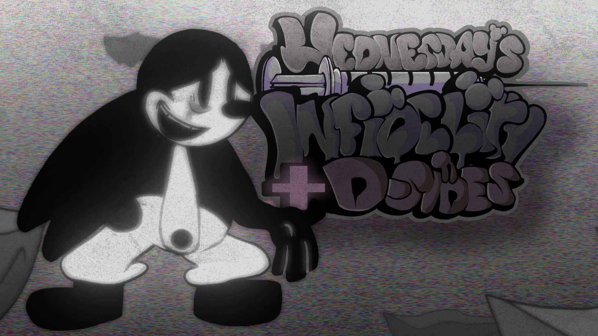
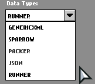

## Wednesday's Infidelity: D-Sides Expansion
For info on usage rights, please read the [license](LICENSE)!




## Documenation
- [Introduction](#introduction)
- [New Content](#new-content)
- [Building the game](#building-instructions)
- [Debug features](#debug-features)
- [Sprite sheet formats](#data-formats)
- [New Charting Events](#new-charting-events)

## Introduction
Wednesday's Infidelity D-Sides Expansion (or W.I.D.S.E./WIDSE) is a mod that expands the content of the original Wednesday's Infidelity and adds another week to the story mode and more songs! The mod is purely inspired by Untold Loneliness composed by Sandi and gives a full new week to Oswald alongside other songs and a few more things!

## New Content

Here's a list of new content added by WIDSE:
- Oswald's Week
- Oswald Tribute Week
- New Charting Events
- Fixed Death screen (if your current character doesn't have a death anim, it will play the Retro BF death anim instead of the base game's original death anim.)
- More funny stuff on PixelBlitzBOI's dev folder
- Runner file atlas

### Oswald's Week content
- Charted Eagerness (song by Sandi and fanmade full version by YourAverageAlligator, charted by PixelBlitzBOI)
- Charted Megrims (song by Sandi + animated icon and charted by PixelBlitzBOI)
- Untold Loneliness V2 (song by Sandi, V2 and chart by PixelBlitzBOI)
- Charted Life On Hiatus (song by Reaper, charted by richilix and PixelBlitzBOI + different vocal mixing)
- Charted Tristis Fabula (song and charted by PixelBlitzBOI)

(art for the Megrims and losing Eagerness/Despair icons are creditless)

### Oswald Tribute Week content
- Charted Despair (song by Funtime Nero, charted by richilix)
- Charted Despondency remix (song by Adam/Madame McHummus, remix by PixelBlitzBOI)
- Charted Eternity (song by Funtime Nero, charted by richilix)
- Charted Vesper (song by doge1smlg chart by richilix)
- Charted Dimensions (song and charted by PixelBlitzBOI)


### Building Instructions:
Follow the [Friday Night Funkin'](https://github.com/ninjamuffin99/Funkin#build-instructions) source code building guide.

**0.5.2h SPECIFIC BUILDING LIBRARIES**

Run these commands:
```
haxelib set flixel 4.11.0
haxelib set flixel-addons 2.12.0
haxelib set flixel-ui 2.5.0
```
**Make sure you're using Haxe 4.2.5!!**

****IMPORTANT W.I SPECIFIC BUILDING INSTRUCTIONS:****

Run these commands: 
```
haxelib install hxp
haxelib git flxanimate https://github.com/Dot-Stuff/flxanimate
haxelib set flxanimate 1.2.0
haxelib install hscript
haxelib install hxCodec
haxelib set hxCodec 2.5.1
```

Or run the [setup bat](config.bat).

**all the other required liraries can be found [here](all-libraries.txt)**

These libraries are needed and your game will **NOT** build without them!

## Debug Features

With the tag `<define name="PRIVATE_BUILD"/> ` in the [Project.xml](Project.xml), you unlock these debug features...
- Press 3 to pause the game no matter what
- Press T on the main menu to 100% the game
- Always allowed to delete your progress even if you just reset
- Able to skip ANY cutscene/video playing
- Automatticly hides Discord RPC
- Able to toggle botplay
- Able to skip the intro

**HEY, PIXEL! THE ORIGINAL TAG IS `<define name="VIDEOS_ALOWED"/>` STOP FORGETTING 😭**

## Data Formats

W.I Supports five built in data types:
- Genric Xmls (Commonly Supported in game engines)
- Sparrow V1-2 (Default FNF Format)
- Packer (Week 6 TXT Format)
- Json Format (HASH and Array Supported)
- Runner (Self-rewritten ram-reducing xml, check [RUNNER.md](RUNNER.md) for more information)

[Paths](source/util/Paths.hx) has a easy function to get frames based on a [Data Type](source/data/DataType.hx) value. [getAtlasFromData(key:String, data:DataType, ?library:String)](source/util/Paths.hx#L342).

Also [Character.hx](source/gameObjects/Character.hx) has a data type paramter that can easily be edited.



If you want to write Runner xml files, please dont copy stuff from [assets/shared/images/characters/RUNNER/DepressedRabbit_Assets.runner](assets/shared/images/characters/RUNNER/DepressedRabbit_Assets.runner), please follow the [proper guide](RUNNER.md#how-to-manually-write-a-runner-file)

****NOTE:****
You have to click reload image for the data type to update
Sometimes it will crash when you do that so you should just add to to the Json

### Scaling Sprite Sheets

Download [Free Texture Packer](http://free-tex-packer.com/) and Install it.

Now you want to export your adobe animate animations as a PNG Sequence, ****make sure your DPI is 72****.


Then put all of it into [Free Texture Packer](http://free-tex-packer.com/) with these settings (you can change these to your liking): 


After you've made the sprite sheet look good, export the sprite sheet.

## New Charting Events
**(By Pixel :D)**

I've added some new events for much easier charting! Now you won't have to do 1 hour of unsuccessful coding using script.hx (even though i literally did that for half the mod XD).
**Here are the new events I've added:**
- camGame On
- Add Cinematic Bars (High)
- Add Cinematic Bars (Low)
- Remove Cinematic Bars
- Hud Fade Out
- Hud Fade Out (Keep notes and healthbar)
- Hud Fade In (Only notes and healthbar)
- Hud Fade In
- blackFuck Flash (PRIVATE_BUILD tag replacement for Flash Black)

**NOTE: there's literally no difference between Add Cinematic Bars (High) and (Low). Why? Because it's broken and I can't fix it! :D**
